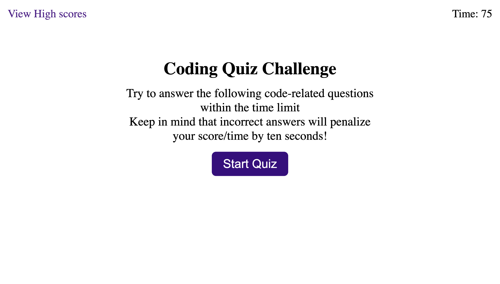
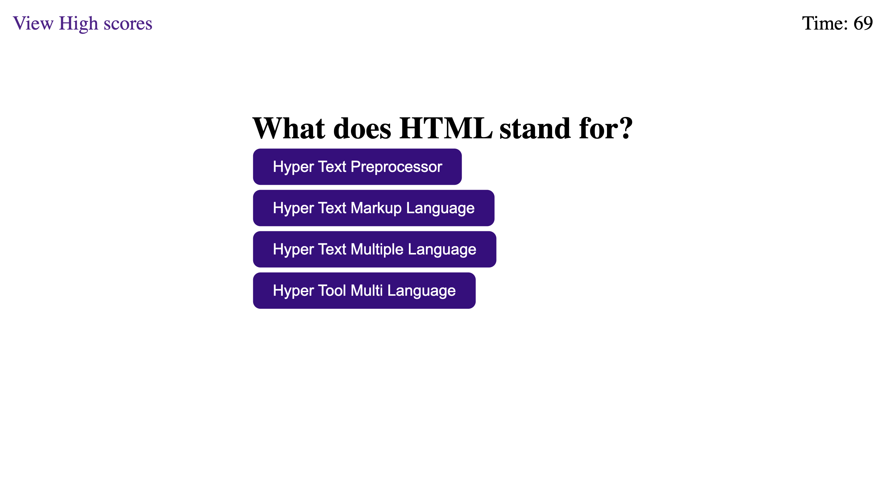
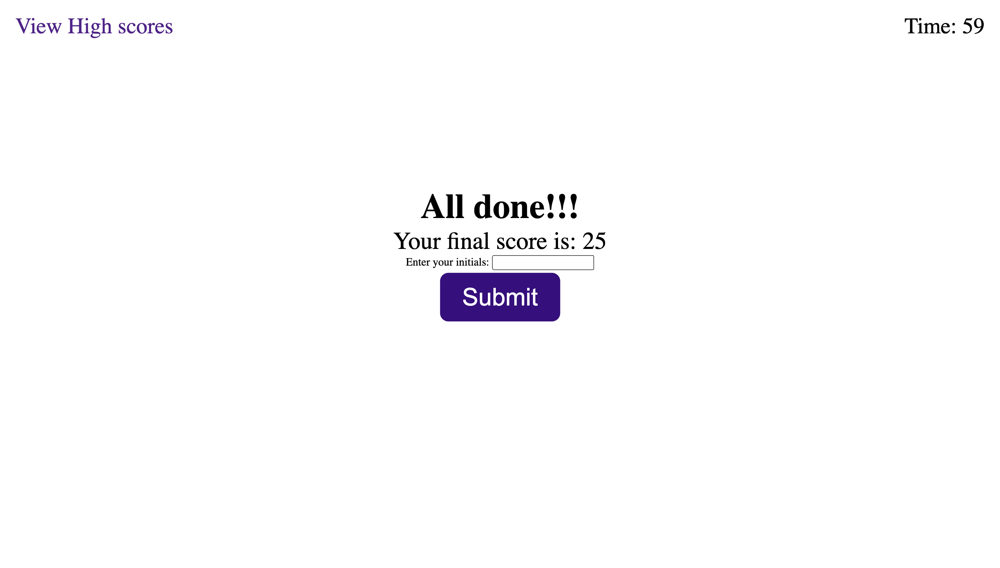
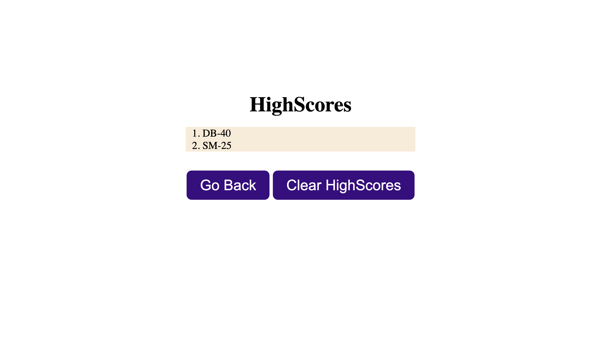

## About the repository

This repository contains code for a Code quiz as part of University of Washington's Coding [bootcamp](https://bootcamp.uw.edu/coding/). There are two types of challenges in this course:

* On-the-job ticket or feature request challenges give a starter code in a folder called Develop, which we'll modify to complete the challenge.

* Job-seeking coding assessments or take-home assignments don't provide starter code. We'll build these from scratch.

## User story

```
AS A coding boot camp student
I WANT to take a timed quiz on JavaScript fundamentals that stores high scores
SO THAT I can gauge my progress compared to my peers
```

## Acceptance criteria

```
GIVEN I am taking a code quiz
WHEN I click the start button
THEN a timer starts and I am presented with a question
WHEN I answer a question
THEN I am presented with another question
WHEN I answer a question incorrectly
THEN time is subtracted from the clock
WHEN all questions are answered or the timer reaches 0
THEN the game is over
WHEN the game is over
THEN I can save my initials and score
```

## Changes added

* Use timer functionality - setInterval and clearInterval

* Use event listeners on button click events

* Use LocalStorage to store the high scores

* Use sort functionality on arrays to sort the high scores list

* Use Web APIs to create and set attributes on HTML elements.

## Result

Deployed URL: https://divyapriyababu.github.io/Code_Quiz







